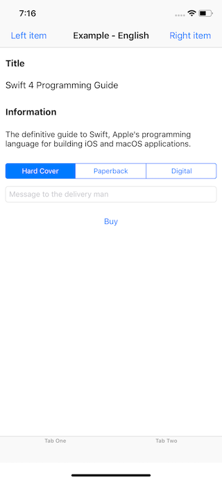
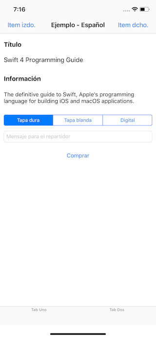

# Easy XIB and Storyboard Localization

 

Example project for my post [Easy XIB and Storyboard Localization](https://medium.com/@mario.negro.martin/easy-xib-and-storyboard-localization-b2794c69c9db).

This repository serves as an example on how to localize some UIKit controls:

- `UILabel`
- `UIButton`
- `UITextField` placeholder
- `UISegmentedControl`
- `UIBarItem` for tab bar items and navigation bar items
- `UINavigationItem`

Review `Localizable.swift` to check it.

 
